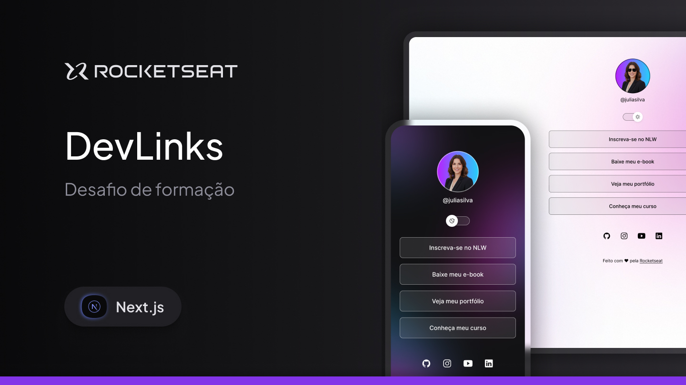

# [GabLinks(Link)](https://site-blog-bay.vercel.app/blog)

DevLinks é um agregador de links responsivo e com troca de tema que você pode usar como cartão de visitas nas suas redes sociais.
Esse é um dos desafios práticos da formação de Next, um dos conteúdos disponíveis para alunos da Rocketseat. (O layout não esta igual porque eu ja aproveitei e usei esse projeto para ser a minha cnetral de links😁)

## 🎨 Layout

O layout da aplicação está disponível no Figma:

<a href="https://www.figma.com/design/od0i5pIqCrWnwRhoxlIbtN/DevLinks-•-Next.js--Community-?node-id=3602-624&t=RxsQ7kyi6EPpTNzN-0">
  
</a>

## 🚀 Começando

Estas instruções permitirão que você obtenha uma cópia do projeto funcionando em sua máquina para desenvolvimento e testes.

## 🔧 Instalação

### Pré-requisitos

Antes de começar, você precisará ter a seguinte ferramenta instalada em sua máquina:
[VSCode](https://code.visualstudio.com/)

Dentro do terminal do VSCode, escreva o seguinte código:

```
git init
```

```
git clone https://github.com/Gabrielingnau/site-blog.git
```

Instale as depêndecias com:

```
npm install
```

Depois é só rodar o projeto com:

```
npm run dev
```

## 🛠️ Tecnologias

- [Next.js](https://nextjs.org) - Biblioteca para interfaces de usuário
- [ShadcnUi](https://ui.shadcn.com) - Um conjunto de componentes lindamente projetados
- [Tailwindcss](https://tailwindcss.com) - Uma estrutura CSS de utilidade-first com classes
- [Typescript](https://www.typescriptlang.org/) - Sintaxe para tipos
- [Prismic](https://prismic.io) - CMS headless com conteúdo via API.
---

# ⌨️ com ❤️ por [Gabriel Lingnau](https://www.linkedin.com/in/gabriel-lingnau-3bb17b266/)

=======
