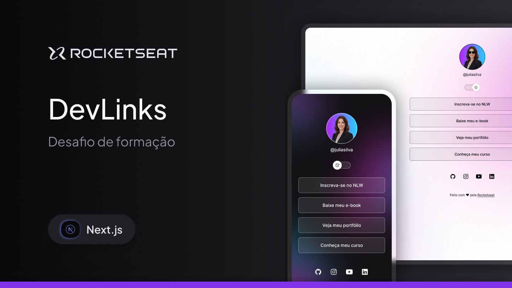

# [GabLinks(Link)](https://links.gabrielingnau.com)

GabLinks é a minha central de links pessoal — um agregador simples, rápido e responsivo que uso como cartão de visitas online.

A ideia do projeto foi ter um lugar único para concentrar meus principais links (portfólio, projetos, redes, etc.), com uma interface limpa, suporte a tema claro/escuro e foco em usabilidade.

Além de resolver uma necessidade real minha, também usei esse projeto para trabalhar na organização de layout, componentização e integração com CMS.

## 🎯 Objetivo

Criar uma página leve e funcional que facilite o acesso aos meus links principais, podendo ser compartilhada facilmente em qualquer rede social.

## 🎨 Layout

O layout da aplicação está disponível no Figma:

<a href="https://www.figma.com/design/od0i5pIqCrWnwRhoxlIbtN/DevLinks-•-Next.js--Community-?node-id=3602-624&t=RxsQ7kyi6EPpTNzN-0">
  
</a>

## 🚀 Começando

Estas instruções permitirão que você obtenha uma cópia do projeto funcionando em sua máquina para desenvolvimento e testes.

## 🔧 Instalação

### Pré-requisitos

Antes de começar, você precisará ter a seguinte ferramenta instalada em sua máquina:
[VSCode](https://code.visualstudio.com/)

Dentro do terminal do VSCode, escreva o seguinte código:

```
git init
```

```
git clone https://github.com/Gabrielingnau/GabLinks.git
```

Instale as depêndecias com:

```
npm install
```

Depois é só rodar o projeto com:

```
npm run dev
```

## 🛠️ Tecnologias

- [Next.js](https://nextjs.org) - Biblioteca para interfaces de usuário
- [ShadcnUi](https://ui.shadcn.com) - Um conjunto de componentes lindamente projetados
- [Tailwindcss](https://tailwindcss.com) - Uma estrutura CSS de utilidade-first com classes
- [Typescript](https://www.typescriptlang.org/) - Sintaxe para tipos
- [Prismic](https://prismic.io) - CMS headless com conteúdo via API.
---

# ⌨️ com ❤️ por [Gabriel Lingnau](https://www.linkedin.com/in/gabriel-lingnau-3bb17b266/)

=======
